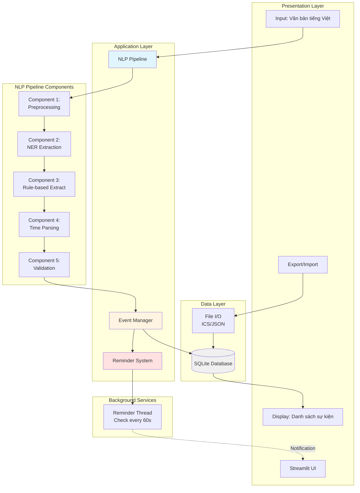
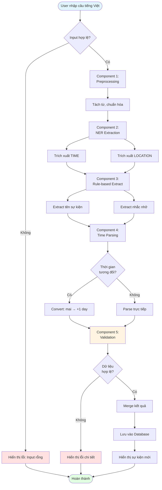
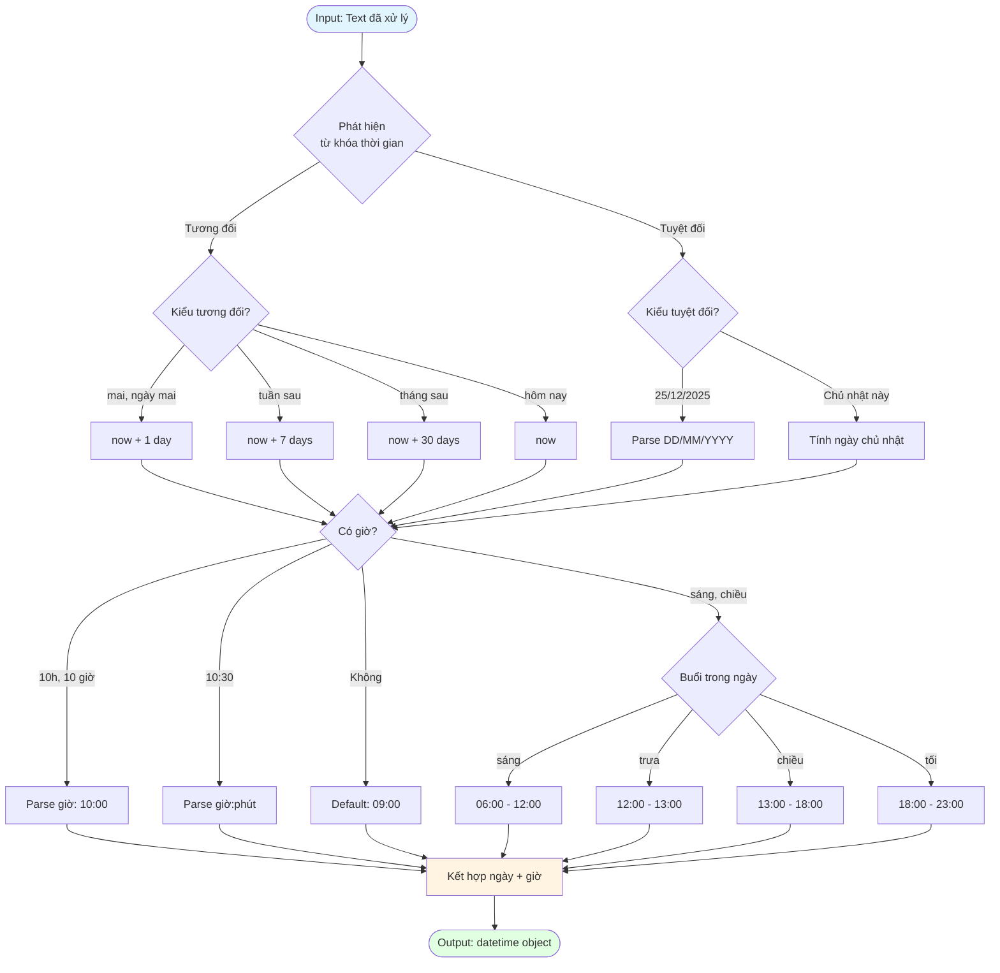
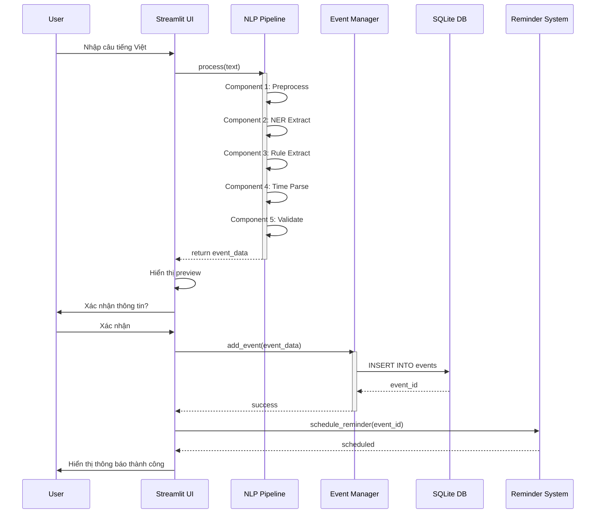
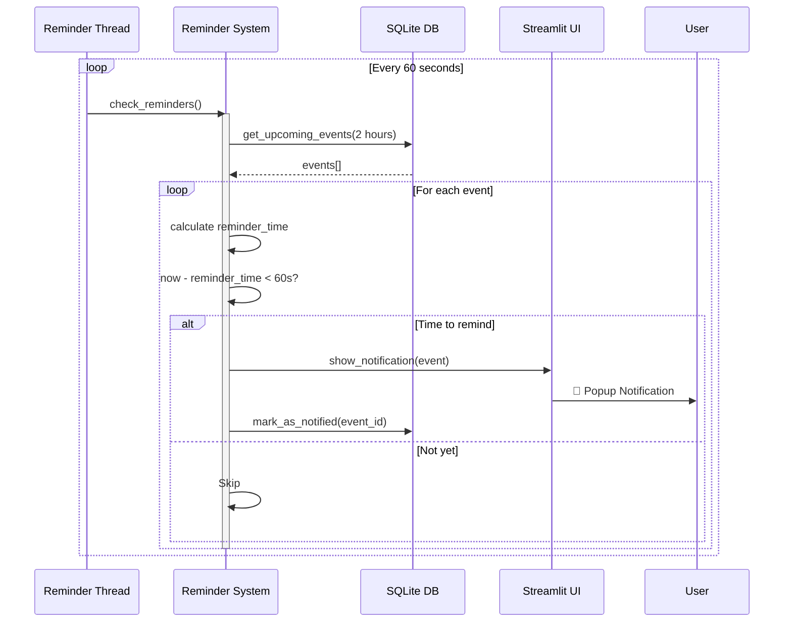
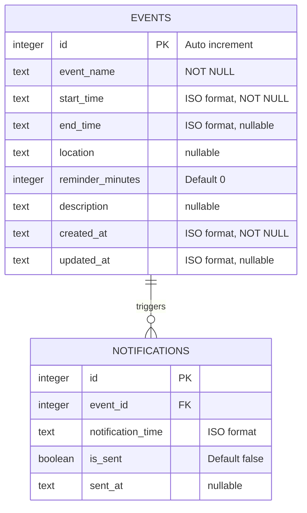
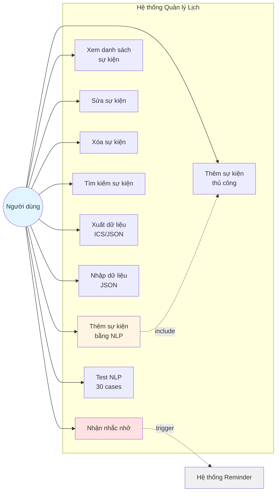
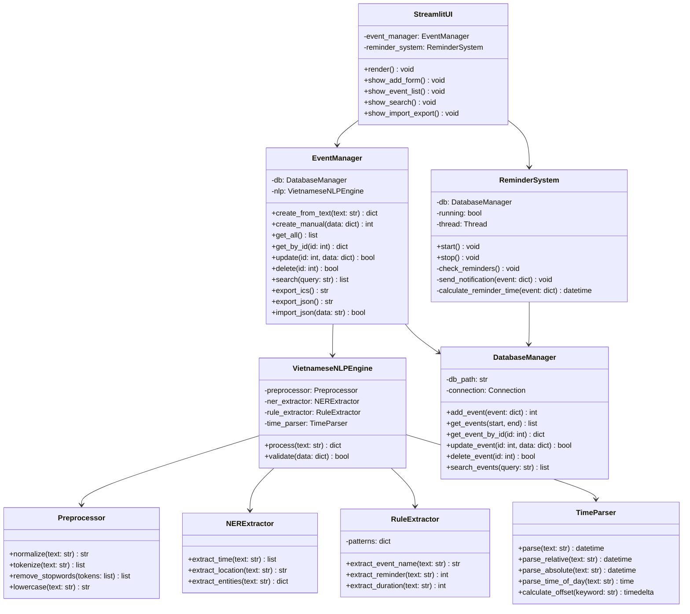
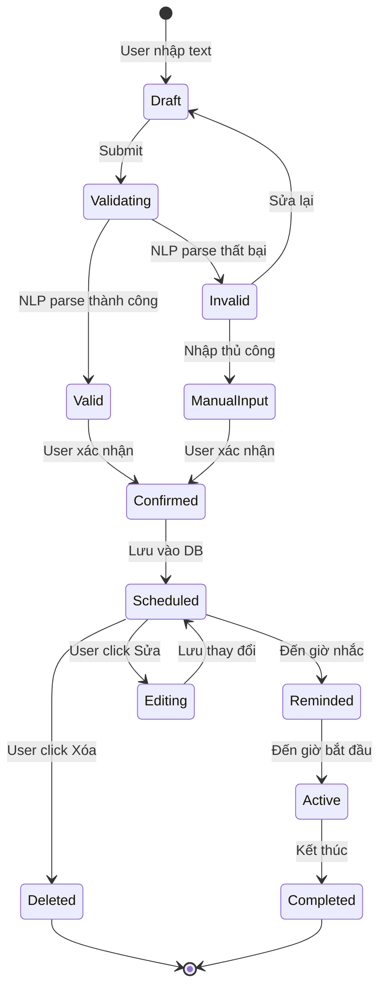

# Sơ Đồ Thiết Kế Hệ Thống - Vietnamese NLP Event Management

## Mục lục
1. [Sơ đồ khối - Kiến trúc tổng thể](#1-sơ-đồ-khối---kiến-trúc-tổng-thể)
2. [Flowchart - Luồng xử lý NLP](#2-flowchart---luồng-xử-lý-nlp)
3. [Sequence Diagram - Tương tác giữa các thành phần](#3-sequence-diagram---tương-tác-giữa-các-thành-phần)
4. [ERD - Entity Relationship Diagram](#4-erd---entity-relationship-diagram)
5. [Use Case Diagram](#5-use-case-diagram)
6. [Class Diagram - Cấu trúc code](#6-class-diagram---cấu-trúc-code)
7. [State Diagram - Trạng thái sự kiện](#7-state-diagram---trạng-thái-sự-kiện)

---

## 1. SƠ ĐỒ KHỐI - KIẾN TRÚC TỔNG THỂ

Sơ đồ này mô tả kiến trúc tổng thể của hệ thống, bao gồm các lớp chính: Presentation, Application, Data và Background Services.



**Mô tả:**
- **Presentation Layer**: Giao diện Streamlit cho phép người dùng nhập văn bản, xem danh sách sự kiện, và export/import dữ liệu
- **Application Layer**: Xử lý logic chính bao gồm NLP Pipeline, Event Manager và Reminder System
- **NLP Pipeline**: 5 components xử lý tuần tự từ preprocessing đến validation
- **Data Layer**: SQLite database và file I/O cho import/export
- **Background Services**: Thread chạy nền kiểm tra nhắc nhở mỗi 60 giây

---

## 2. FLOWCHART - LUỒNG XỬ LÝ NLP

### 2.1. Flowchart Tổng Quát

Sơ đồ này mô tả luồng xử lý từ khi người dùng nhập văn bản tiếng Việt đến khi sự kiện được lưu vào database.



**Các bước chính:**
1. Kiểm tra input hợp lệ
2. Preprocessing: Tách từ và chuẩn hóa văn bản
3. NER Extraction: Trích xuất thực thể (TIME, LOCATION)
4. Rule-based Extract: Trích xuất tên sự kiện và thông tin nhắc nhở
5. Time Parsing: Chuyển đổi thời gian tương đối/tuyệt đối
6. Validation: Kiểm tra tính hợp lệ của dữ liệu
7. Lưu vào database và hiển thị

### 2.2. Flowchart Chi Tiết Component 4: Time Parsing

Sơ đồ này chi tiết hóa quá trình phân tích và chuyển đổi thời gian từ văn bản tiếng Việt.



**Xử lý thời gian tương đối:**
- "mai", "ngày mai" → +1 ngày
- "tuần sau" → +7 ngày
- "tháng sau" → +30 ngày
- "hôm nay" → ngày hiện tại

**Xử lý thời gian tuyệt đối:**
- Format DD/MM/YYYY
- Tính toán ngày trong tuần (VD: "Chủ nhật này")

**Xử lý giờ:**
- Giờ cụ thể: "10h", "10 giờ" → 10:00
- Giờ:phút: "10:30"
- Buổi trong ngày: sáng (6-12h), trưa (12-13h), chiều (13-18h), tối (18-23h)
- Mặc định: 09:00 nếu không có thông tin

---

## 3. SEQUENCE DIAGRAM - TƯƠNG TÁC GIỮA CÁC THÀNH PHẦN

### 3.1. Thêm Sự Kiện

Sơ đồ này mô tả luồng tương tác giữa các thành phần khi người dùng thêm một sự kiện mới.



**Luồng hoạt động:**
1. User nhập câu tiếng Việt vào UI
2. UI gọi NLP Pipeline xử lý văn bản qua 5 components
3. NLP trả về dữ liệu sự kiện đã được trích xuất
4. UI hiển thị preview cho user xác nhận
5. Event Manager lưu vào database và nhận event_id
6. Reminder System lên lịch nhắc nhở
7. UI thông báo thành công

### 3.2. Hệ Thống Nhắc Nhở

Sơ đồ này mô tả cách hoạt động của hệ thống nhắc nhở tự động chạy nền.



**Cơ chế hoạt động:**
1. Reminder Thread chạy vòng lặp mỗi 60 giây
2. Kiểm tra các sự kiện sắp diễn ra trong 2 giờ tới
3. Tính toán thời gian nhắc nhở cho từng sự kiện
4. Nếu đến giờ nhắc (trong vòng 60s), hiển thị notification
5. Đánh dấu đã gửi thông báo trong database
6. Lặp lại quá trình

---

## 4. ERD - ENTITY RELATIONSHIP DIAGRAM

Sơ đồ này mô tả cấu trúc cơ sở dữ liệu của hệ thống.



### SQL Schema

```sql
-- Bảng sự kiện chính
CREATE TABLE events (
    id INTEGER PRIMARY KEY AUTOINCREMENT,
    event_name TEXT NOT NULL,
    start_time TEXT NOT NULL,          -- ISO 8601 format: YYYY-MM-DD HH:MM:SS
    end_time TEXT,                      -- ISO 8601 format, nullable
    location TEXT,                      -- Địa điểm tổ chức
    reminder_minutes INTEGER DEFAULT 0, -- Số phút nhắc trước (0 = không nhắc)
    description TEXT,                   -- Mô tả chi tiết
    created_at TEXT NOT NULL,           -- Thời gian tạo
    updated_at TEXT                     -- Thời gian cập nhật cuối
);

-- Bảng thông báo (tùy chọn, cho hệ thống phức tạp hơn)
CREATE TABLE notifications (
    id INTEGER PRIMARY KEY AUTOINCREMENT,
    event_id INTEGER NOT NULL,
    notification_time TEXT NOT NULL,
    is_sent BOOLEAN DEFAULT 0,
    sent_at TEXT,
    FOREIGN KEY (event_id) REFERENCES events(id) ON DELETE CASCADE
);

-- Indexes để tối ưu truy vấn
CREATE INDEX idx_start_time ON events(start_time);
CREATE INDEX idx_event_name ON events(event_name);
CREATE INDEX idx_notification_time ON notifications(notification_time);
```

**Mô tả bảng:**

**EVENTS:**
- `id`: ID tự tăng, khóa chính
- `event_name`: Tên sự kiện (bắt buộc)
- `start_time`: Thời gian bắt đầu (bắt buộc, ISO 8601)
- `end_time`: Thời gian kết thúc (tùy chọn)
- `location`: Địa điểm tổ chức
- `reminder_minutes`: Thời gian nhắc trước (phút), 0 = không nhắc
- `description`: Mô tả chi tiết
- `created_at`: Thời gian tạo record
- `updated_at`: Thời gian cập nhật cuối

**NOTIFICATIONS:**
- `id`: ID tự tăng, khóa chính
- `event_id`: Liên kết đến events (khóa ngoại)
- `notification_time`: Thời gian gửi thông báo
- `is_sent`: Đã gửi chưa (boolean)
- `sent_at`: Thời điểm thực tế đã gửi

---

## 5. USE CASE DIAGRAM

Sơ đồ này mô tả các use case (chức năng) mà người dùng có thể thực hiện với hệ thống.



**Các Use Case:**

1. **Thêm sự kiện bằng NLP**: Nhập câu tiếng Việt tự nhiên, hệ thống tự động trích xuất thông tin
2. **Thêm sự kiện thủ công**: Nhập thông tin sự kiện qua form
3. **Xem danh sách sự kiện**: Hiển thị tất cả sự kiện theo lịch
4. **Sửa sự kiện**: Chỉnh sửa thông tin sự kiện đã tạo
5. **Xóa sự kiện**: Xóa sự kiện không cần thiết
6. **Tìm kiếm sự kiện**: Tìm kiếm theo tên, ngày, địa điểm
7. **Xuất dữ liệu (ICS/JSON)**: Export lịch ra file ICS (iCalendar) hoặc JSON
8. **Nhập dữ liệu (JSON)**: Import sự kiện từ file JSON
9. **Nhận nhắc nhở**: Nhận thông báo tự động trước khi sự kiện diễn ra
10. **Test NLP (30 cases)**: Chức năng test với 30 test case mẫu

**Mối quan hệ:**
- UC1 (Thêm bằng NLP) include UC2 (Thêm thủ công) - nếu NLP thất bại, fallback về nhập tay
- UC9 (Nhận nhắc nhở) trigger Hệ thống Reminder tự động

---

## 6. CLASS DIAGRAM - CẤU TRÚC CODE

Sơ đồ này mô tả cấu trúc các class chính trong hệ thống và mối quan hệ giữa chúng.



**Mô tả các class chính:**

**VietnameseNLPEngine**: Class trung tâm xử lý NLP, điều phối 4 components con
- Preprocessor: Tiền xử lý văn bản
- NERExtractor: Trích xuất thực thể có tên
- RuleExtractor: Trích xuất dựa trên luật
- TimeParser: Phân tích và chuyển đổi thời gian

**DatabaseManager**: Quản lý tất cả tương tác với SQLite database

**EventManager**: Class trung gian giữa UI và backend, cung cấp API đầy đủ cho CRUD operations

**ReminderSystem**: Hệ thống nhắc nhở chạy nền với thread riêng

**StreamlitUI**: Giao diện người dùng Streamlit

---

## 7. STATE DIAGRAM - TRẠNG THÁI SỰ KIỆN

Sơ đồ này mô tả vòng đời và các trạng thái của một sự kiện trong hệ thống.



**Các trạng thái:**

1. **Draft**: Người dùng đang nhập văn bản
2. **Validating**: Hệ thống đang xử lý và validate dữ liệu
3. **Valid**: Dữ liệu hợp lệ, chờ xác nhận
4. **Invalid**: Dữ liệu không hợp lệ
5. **ManualInput**: Chuyển sang nhập thủ công
6. **Confirmed**: Người dùng đã xác nhận
7. **Scheduled**: Đã lưu vào DB, đang chờ đến giờ
8. **Reminded**: Đã gửi thông báo nhắc nhở
9. **Active**: Sự kiện đang diễn ra
10. **Editing**: Đang chỉnh sửa
11. **Completed**: Hoàn thành
12. **Deleted**: Đã xóa

**Luồng chuyển đổi:**
- Từ Draft → Validating → Valid/Invalid
- Invalid có thể quay lại Draft hoặc chuyển sang ManualInput
- Valid → Confirmed → Scheduled
- Scheduled có thể chuyển sang Editing (sau đó quay lại Scheduled) hoặc Deleted
- Scheduled → Reminded → Active → Completed

---

## Kết luận

Các sơ đồ trên cung cấp cái nhìn toàn diện về hệ thống quản lý lịch với NLP tiếng Việt:

✅ **Kiến trúc rõ ràng**: 4 layers với trách nhiệm riêng biệt
✅ **Luồng xử lý chi tiết**: Từ input đến output qua 5 components NLP
✅ **Tương tác mạch lạc**: Sequence diagrams mô tả rõ các use case
✅ **Database thiết kế tốt**: ERD đơn giản nhưng đầy đủ
✅ **Use cases đầy đủ**: 10 chức năng chính
✅ **Code structure**: Class diagram hỗ trợ implementation
✅ **Lifecycle quản lý**: State diagram theo dõi vòng đời sự kiện

Tất cả sơ đồ được tạo bằng Mermaid.js, có thể:
- Render trực tiếp trên GitHub
- Export sang PNG/SVG cho báo cáo
- Dễ dàng maintain và version control
- Professional và dễ hiểu
