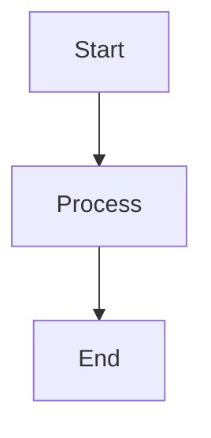

# Hướng Dẫn Export Mermaid Diagrams

Tài liệu này hướng dẫn cách export các sơ đồ Mermaid từ file `diagrams.md` sang định dạng hình ảnh (PNG, SVG) để sử dụng trong báo cáo hoặc trình bày.

## Mục lục
1. [Export trực tiếp trên GitHub](#1-export-trực-tiếp-trên-github)
2. [Sử dụng Mermaid Live Editor](#2-sử-dụng-mermaid-live-editor)
3. [VSCode Extension](#3-vscode-extension)
4. [Command Line Interface (CLI)](#4-command-line-interface-cli)
5. [Online Tools khác](#5-online-tools-khác)

---

## 1. Export trực tiếp trên GitHub

GitHub tự động render các Mermaid diagrams trong Markdown files.

### Cách xem:
1. Truy cập repository trên GitHub
2. Mở file `docs/diagrams.md`
3. Sơ đồ sẽ tự động hiển thị

### Lưu ý:
- ✅ Không cần cài đặt gì
- ✅ Hiển thị trực tiếp trên web
- ❌ Không thể download trực tiếp dưới dạng file ảnh từ GitHub
- 💡 Có thể chụp màn hình (screenshot) để lưu lại

---

## 2. Sử dụng Mermaid Live Editor

**Mermaid Live Editor** là công cụ online chính thức, miễn phí và dễ sử dụng nhất.

### Bước 1: Truy cập
Mở trình duyệt và truy cập: **https://mermaid.live/**

### Bước 2: Copy code Mermaid
1. Mở file `docs/diagrams.md`
2. Copy toàn bộ code Mermaid của sơ đồ muốn export (từ ` ```mermaid` đến ` ``` `)
3. Ví dụ:


### Bước 3: Paste vào Editor
1. Paste code vào khung bên trái của Mermaid Live Editor
2. Sơ đồ sẽ tự động render ở bên phải

### Bước 4: Export
Nhấn vào các nút ở góc phải trên:
- **PNG**: Download dưới dạng PNG (độ phân giải cao)
- **SVG**: Download dưới dạng SVG (vector, có thể scale không giảm chất lượng)
- **Edit in Mermaid Chart**: Mở trong Mermaid Chart để edit nâng cao

### Ưu điểm:
- ✅ Không cần cài đặt
- ✅ Miễn phí 100%
- ✅ Export chất lượng cao
- ✅ Hỗ trợ nhiều định dạng (PNG, SVG)
- ✅ Preview real-time

### Nhược điểm:
- ❌ Phải export từng sơ đồ một
- ❌ Cần kết nối internet

---

## 3. VSCode Extension

Nếu bạn đang sử dụng Visual Studio Code, có thể cài extension để export trực tiếp.

### Bước 1: Cài đặt Extension

**Option A: Markdown Preview Mermaid Support**
```
Extension ID: bierner.markdown-mermaid
```

**Option B: Mermaid Markdown Syntax Highlighting**
```
Extension ID: bpruitt-goddard.mermaid-markdown-syntax-highlighting
```

**Option C: Mermaid Editor** (Khuyến nghị)
```
Extension ID: tomoyukim.vscode-mermaid-editor
```

### Bước 2: Cài đặt
1. Mở VSCode
2. Nhấn `Ctrl+Shift+X` (hoặc `Cmd+Shift+X` trên Mac)
3. Tìm kiếm extension name
4. Click **Install**

### Bước 3: Export

**Cách 1: Markdown Preview Mermaid Support**
1. Mở file `diagrams.md`
2. Nhấn `Ctrl+Shift+V` để mở Markdown Preview
3. Right-click vào sơ đồ → **Copy Image** hoặc **Save as...**

**Cách 2: Mermaid Editor**
1. Mở file `diagrams.md`
2. Click chuột phải vào code block Mermaid
3. Chọn **Mermaid Editor: Preview**
4. Trong cửa sổ preview, click biểu tượng **Export** (góc trên bên phải)
5. Chọn định dạng: PNG, SVG, hoặc PDF

### Ưu điểm:
- ✅ Làm việc offline
- ✅ Tích hợp với workflow
- ✅ Preview nhanh

### Nhược điểm:
- ❌ Cần cài đặt extension
- ❌ Chất lượng export phụ thuộc vào extension

---

## 4. Command Line Interface (CLI)

Sử dụng **Mermaid CLI** để export hàng loạt hoặc tự động hóa.

### Bước 1: Cài đặt Node.js
Tải và cài đặt Node.js từ: https://nodejs.org/

### Bước 2: Cài đặt Mermaid CLI
```bash
npm install -g @mermaid-js/mermaid-cli
```

### Bước 3: Export từng sơ đồ

**Tạo file Mermaid riêng (khuyến nghị):**

1. Tách mỗi sơ đồ ra file `.mmd` riêng:
```bash
# Ví dụ: block_diagram.mmd
graph TB
    A[Start] --> B[Process]
    B --> C[End]
```

2. Export:
```bash
# Export sang PNG
mmdc -i block_diagram.mmd -o block_diagram.png

# Export sang SVG
mmdc -i block_diagram.mmd -o block_diagram.svg

# Export sang PDF
mmdc -i block_diagram.mmd -o block_diagram.pdf
```

**Export từ Markdown file:**
```bash
# Extract và export tất cả diagrams
mmdc -i docs/diagrams.md -o output/
```

### Bước 4: Tùy chỉnh

**Thay đổi background:**
```bash
mmdc -i diagram.mmd -o diagram.png -b transparent
```

**Thay đổi theme:**
```bash
mmdc -i diagram.mmd -o diagram.png -t dark
# Hoặc: default, forest, neutral, dark
```

**Thay đổi kích thước:**
```bash
mmdc -i diagram.mmd -o diagram.png -w 1920 -H 1080
```

**Config file (mermaid.config.json):**
```json
{
  "theme": "default",
  "themeVariables": {
    "primaryColor": "#e1f5ff",
    "primaryTextColor": "#000",
    "primaryBorderColor": "#000",
    "lineColor": "#000",
    "secondaryColor": "#fff4e1",
    "tertiaryColor": "#f0f0f0"
  }
}
```

Sử dụng:
```bash
mmdc -i diagram.mmd -o diagram.png -c mermaid.config.json
```

### Ưu điểm:
- ✅ Export hàng loạt
- ✅ Tự động hóa được
- ✅ Tùy chỉnh cao
- ✅ Chất lượng export tốt

### Nhược điểm:
- ❌ Cần cài đặt Node.js và CLI
- ❌ Phức tạp hơn cho người mới

---

## 5. Online Tools khác

### 5.1. Mermaid Chart (https://www.mermaidchart.com/)

**Tính năng:**
- ✅ Editor nâng cao
- ✅ Collaboration (làm việc nhóm)
- ✅ Version control
- ✅ Export PNG, SVG, PDF
- ⚠️ Có phiên bản free (giới hạn) và pro (trả phí)

### 5.2. Draw.io (https://app.diagrams.net/)

**Cách sử dụng:**
1. Mở Draw.io
2. Chọn **Arrange** → **Insert** → **Advanced** → **Mermaid**
3. Paste code Mermaid
4. Click **Insert**
5. Export: **File** → **Export as** → PNG/SVG/PDF

**Ưu điểm:**
- ✅ Miễn phí
- ✅ Nhiều tính năng chỉnh sửa
- ✅ Export nhiều định dạng

### 5.3. Kroki (https://kroki.io/)

**API-based service:**
```bash
# Sử dụng curl để generate diagram
curl -X POST https://kroki.io/mermaid/png \
  -H "Content-Type: text/plain" \
  --data-binary @diagram.mmd \
  -o output.png
```

---

## 6. Batch Export Script (Python)

Script Python để tự động export tất cả diagrams từ `diagrams.md`:

```python
#!/usr/bin/env python3
import re
import subprocess
import os

# Đọc file diagrams.md
with open('docs/diagrams.md', 'r', encoding='utf-8') as f:
    content = f.read()

# Tìm tất cả code blocks Mermaid
pattern = r'```mermaid\n(.*?)```'
diagrams = re.findall(pattern, content, re.DOTALL)

# Tạo thư mục output
os.makedirs('output', exist_ok=True)

# Export từng diagram
for i, diagram in enumerate(diagrams, 1):
    # Lưu vào file tạm
    temp_file = f'temp_{i}.mmd'
    with open(temp_file, 'w', encoding='utf-8') as f:
        f.write(diagram)
    
    # Export sang PNG
    output_file = f'output/diagram_{i}.png'
    subprocess.run(['mmdc', '-i', temp_file, '-o', output_file])
    
    # Xóa file tạm
    os.remove(temp_file)
    
    print(f'Exported diagram {i}/{len(diagrams)}: {output_file}')

print(f'✅ Done! Exported {len(diagrams)} diagrams to output/ folder')
```

**Sử dụng:**
```bash
# Cài mermaid-cli trước
npm install -g @mermaid-js/mermaid-cli

# Chạy script
python3 export_all_diagrams.py
```

---

## 7. Khuyến nghị cho Đồ án

### Cho báo cáo in PDF:
1. ✅ **Sử dụng Mermaid Live Editor** export PNG với độ phân giải cao
2. ✅ Theme: `default` (rõ ràng nhất khi in)
3. ✅ Background: `white` (không dùng transparent)
4. ✅ Độ phân giải: Ít nhất 1920x1080

### Cho trình bày PowerPoint:
1. ✅ Export SVG (scale không mất chất lượng)
2. ✅ Hoặc PNG với resolution cao

### Cho GitHub/Documentation:
1. ✅ Giữ nguyên Mermaid code trong Markdown
2. ✅ GitHub tự động render đẹp
3. ✅ Dễ maintain và update

### Workflow đề xuất:
```
1. Viết diagrams bằng Mermaid code trong diagrams.md
2. Commit lên GitHub → auto render
3. Khi cần export cho báo cáo:
   - Vào Mermaid Live Editor
   - Copy-paste từng diagram
   - Export PNG
4. Lưu ảnh vào docs/images/ (nếu cần)
```

---

## Tổng kết

| Phương pháp | Dễ sử dụng | Chất lượng | Batch Export | Offline | Khuyến nghị |
|-------------|------------|------------|--------------|---------|-------------|
| GitHub      | ⭐⭐⭐⭐⭐ | ⭐⭐⭐ | ❌ | ❌ | View only |
| Mermaid Live| ⭐⭐⭐⭐⭐ | ⭐⭐⭐⭐⭐ | ❌ | ❌ | **Best cho export đơn lẻ** |
| VSCode Ext  | ⭐⭐⭐⭐ | ⭐⭐⭐⭐ | ❌ | ✅ | Tốt cho dev |
| CLI         | ⭐⭐⭐ | ⭐⭐⭐⭐⭐ | ✅ | ✅ | **Best cho batch** |
| Draw.io     | ⭐⭐⭐ | ⭐⭐⭐⭐ | ❌ | ✅ | Nếu cần edit |

**Khuyến nghị cuối cùng:**
- 🥇 **Mermaid Live Editor** - Đơn giản, nhanh, chất lượng cao
- 🥈 **CLI** - Nếu cần export nhiều diagrams cùng lúc
- 🥉 **VSCode Extension** - Nếu đang code trong VSCode

---

## Troubleshooting

### Lỗi: "Command not found: mmdc"
```bash
# Cài lại mermaid-cli
npm install -g @mermaid-js/mermaid-cli

# Hoặc với yarn
yarn global add @mermaid-js/mermaid-cli
```

### Lỗi: Diagram không render đúng
- Kiểm tra syntax Mermaid
- Test trên Mermaid Live Editor trước
- Cập nhật mermaid-cli lên version mới nhất

### Lỗi: Export PNG bị mờ
- Tăng resolution: `mmdc -i diagram.mmd -o output.png -w 2400`
- Hoặc dùng SVG thay vì PNG

---

**Chúc bạn export diagrams thành công! 🎉**
